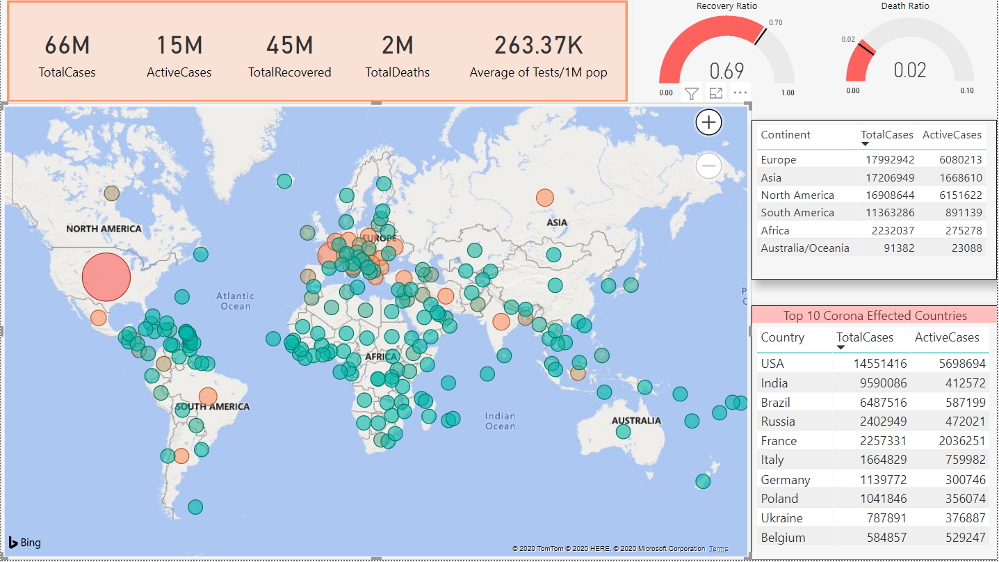
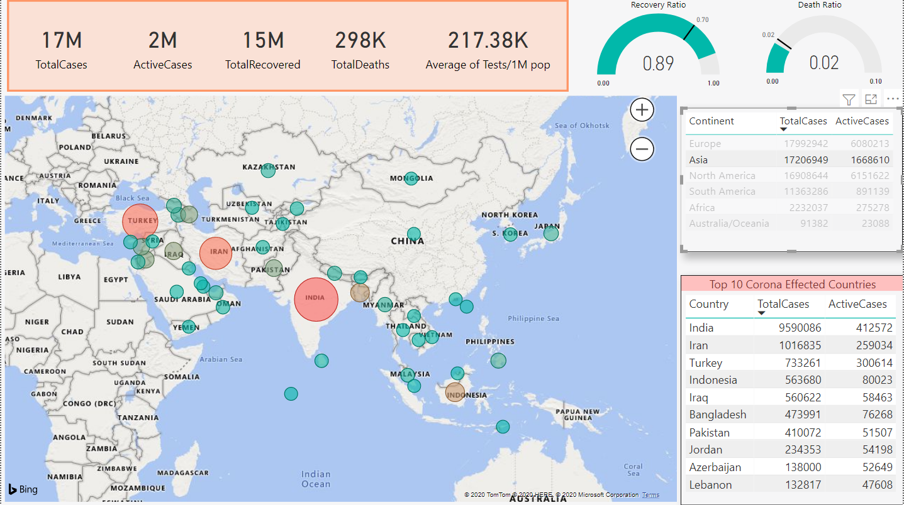
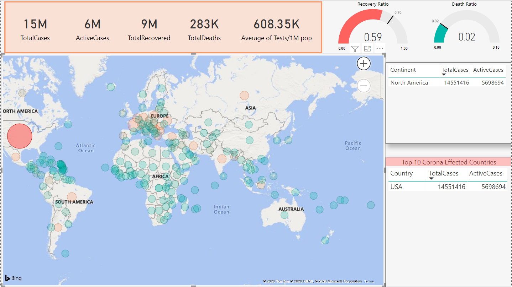

# Covid-19-World-Dashboard-in-Power-BI
A corona virus dashboard in Power BI. The data is extracted directly from the website: https://www.worldometers.info/coronavirus/ with the help of Power BI feature.

The site contains Total Cases, Total Active Cases, Total Recovered Cases, Total Deaths, Aveage Test per million population, Recovery Ratio and Death Ratio.

You can click on a continent to see the no.of cases in that continent and also the no.of cases in the countries of that continent.

You can click on the countries to get detail overview of the corona cases in that country.

